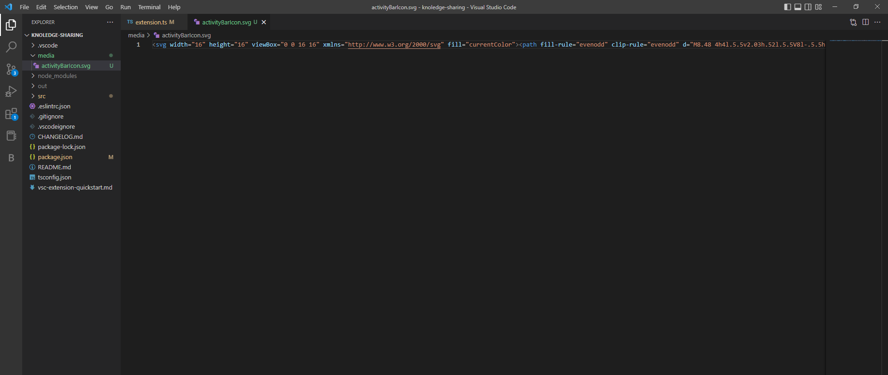

# VS Code Plugin Development

## **1. What is a VS Code Extension and why to develop one?** 

The extensions in Visual Studio are add-ons that allow you to add new features or integrate existing tools to customize your experience. You can find extensions at all levels of complexity, but their main purpose is to increase your productivity and simplify your workflow.

## **2. First Steps**

In order to get started developing your first VS Code extension, make sure you have Node.js and Git installed (if you don't have them, click on the links to install them).

### **2.1 Yeoman**

By prescribing best practices and tools, Yeoman helps you get your new projects off to a flying start. To accomplish this, Yeoman provides an ecosystem of generators. Basically, a generator is a plugin that can be run with the yo command to scaffold complete projects. 

### **2.2 Initial command**

Now, having the theoretical background left behind, let's get our hands dirty! Open a terminal in VS Code and run the following command: 

    npm install -g yo generator-code

With the generator, you can now quickly and easily scaffold a TypeScript or JavaScript project. Run the generator and fill out a few fields for your project: 

    yo code


After configurating the fields, you are ready to run your first Visual Studio Code extension!


### **2.3 Run your first Visual Studio Code Extension**

When the generator of the extension is done, a new folder will be created and it will look like this:


Let's briefly go through some of the main files that we are going to concern ourselves with in this topic.

1. **.vscode** : This folder contains two json files that gives us the ability to launch another version of VScode where we can actually test our extension in.

2. **node_modules** : Pretty straight forward, this folder contains all the libraries we are going to use.

3. **extension.ts** : This is actually the main file of our extension. This is pretty much where you write your code for your extension.

4. **test** : This folder will contain any test that we write.

5. **.vscodeignore** : As .gitignore, this file contains things that we want to ignore when we publish the extension.

6. **package.json** : This is the manifest file in which you declare your extension and commands  

The two main files that we are going to play with are the 'extension.ts' and the 'package.json'. Now that we discussed a bit about the files we got from the generator, let's run it. The generator, has already prepared a small 'Hello World' extension for us. By clicking F5 inside the editor, a new VS Code Extension Development window will pop up in which our extension will be pre-installed and ready to be used. Open the Command Palette (Ctrl+Shift+P) and run the command 'Hello World'. An info pop up will show up saying: 'Hello World from Knowledge Sharing!' 


## **3. Real VS Code Extension Development project**

Since we went through the first general steps we need to follow in order to develop any type of extension we want, let's now create an actual, more complicated extension as an example. 

Our extension is going to be a Daily Todo List. It is going to exist form three panels at the Primary Sidebar, one for 'Primary-List', one for 'Secondary-List' and one 'Today's-Todo-List'. Let's check them out separately: 

- **Primary-List**: We are going to provide as a tree item list some of the daily routines someone can have e.g. Breakfast, Brush Teeth etc. 

- **Secondary-List**:  We are going to provide as a tree item list some of the weekly routines someone can have e.g. Workout, Grocery etc.

- **Today's Todo List**: We are going to provide an empty panel, that the user can fill daily by picking some of the items from the Primary and Secondary List

As we are going to talk a lot for some of the views of Visual Studio Code, let's take a look at the architecture of the containers: 


Let΄s get it started!

### **3.1 Activity Bar - Icon** 

For the purpose of our extension, we are going to use an icon-button at the Activity Bar (as the Explorer, Search, Source Control etc.). In order to keep our files organized, we are going to create a subfolder named "media" to store inside all the icons potentially we are going to use. After that, we need to select a proper icon to be displayed. A nice site to find that kind of icons is Codicon. Once we choose the one we like, the only thing we have to do is to go to their GitHub repo search the name we picked and copy the code. Last but not least, back to our folder we have to create a svg file and paste the code of the icon. 



Now that we have chosen the main icon for our extension, it is time to place it. That's where package.json comes to the game. Inside there, we are going to declare all the commands and the configurations we are going to use. So, on the package.json we add the following lines of code: 

```json
"contributes": {
  "viewsContainers": {
    "activitybar": [
      {
        "id": "daily-todo-list",
        "title": "Daily Todo List",
        "icon": "media/activityBarIcon.svg"
      }
    ]
  }, 
```

### **3.2 Primary Sidebar - Panels**

Now everything seems to be working and if we press F5, we expect to see our icon to be displayed at the Activity Bar, right? No! In order to be displayed we also need to provide the views of our extension. In our scenario, we are going to use the three panels we mentioned previously in the Primary Sidebar: 

```json
"views": {
      "daily-todo-list": [
        {
          "id": "primary-list",
          "name": "Primary List"
        },
        {
          "id": "secondary-list",
          "name": "Secondary List"
        },
		{
          "id": "todays-todo-list",
          "name": "Today's Todo List"
        }
      ]
    },
``` 
Adding these lines, we are ready to press F5 and run our extension : 


## **4. Configurate the settings of the extension**

Once we set our panels, we need to fill them with data in a form of an item list. To do that, first of all we need the data. Since we are talking about daily routines, we are going to provide to the user some predefined daily habits for the "Primary List" and the "Secondary List" but also give him the chance to configurate them (add a new habit or delete an existing one).  One nice solution about this, is to provide them on the general settings of our extension. To set up the settings of our extension, we need to go back to the package.json. For the purpose of our needs, we need two lists of habits for our two panels. Let's see how we can create them: 

```json
"contributes": {
    "configuration":{
      "title": "Daily Todo List",
      "properties": {
        "daily-todo-list.primaryList": {
          "type":"array",
          "default": [
            "Breakfast",
            "Brush Teeth",
            "Shower",
            "Cooking"
          ],
          "items": {
            "type":"string"
          },
          "uniqueItems": true,
          "description": "Habits that are high important daily for you"
        },
        "daily-todo-list.secondaryList": {
          "type":"array",
          "default": [
            "Workout",
            "Groceries",
            "Cleaning",
            "Family Dinner"
          ],
          "items": {
            "type":"string"
          },
          "uniqueItems": true,
          "description": "Habits that are high important weekly for you"
        }
      }
    },
``` 

Let's see where we can see and configurate our habits in the settings of the extensions: 

.png) 
.png)

As we can clearly see, we get these two tables of habits that we wanted. Therefore, we also get a button to add new habits. By hovering over an habit in the list, we have additionally the choice of deleting or editing that habit. We are totally prepared now to move on and display these data to the panels we created previously. 

## **5. Display data in Panels**

Having the only data in the settings it is not that friendly for the user, it is a starting point for configurating the habits of its user once in the beginning. After that, the best idea is to display them on the panels. In order to achieve that in a form of a list, we are going to need a Tree Data Provider. 

### **5.1. Tree Data Provider**

The steps for adding a Tree view are to contribute the Tree view in our package.json , create a Tree Data Provider, and register the Tree Data Provider. Let's see them one by one:

#### **5.1.1. Contribute the Tree views in our package.json**

First thing we have to do, is to let VS Code know that we are contributing a view, using the contributes.views  Contribution Point in package.json . This step is already done, when we made the panels for the Primary Sidebar.

#### **5.1.2. Create a Tree Data Provider**

The second step is to provide data to the view we registered so that VS Code can display the data in the view. To do so, we should first implement the TreeDataProvider. Our TreeDataProvider will provide habits as data, taken from the settings of the extension. For that reason, we are going to create some TypeScript files as helpers. These files are the following: 

- Config.ts
- Constants.ts
- Items.ts
- SettingsAccess.ts
- TreeDataProvider.ts

Let's see examine them in details and see their implementations: 

#### **5.1.2.1. Config.ts** 

This file will contain an interface to help us get the data from the settings in a more clear way. We are going to to set two arrays of strings, one for the Primary Habits and one for the Secondary Habits 

```typescript
export interface Config {
    primaryList: string[];
    secondaryList: string[];
}
``` 

#### **5.1.2.2. Constants.ts**

In this file we are going to store all our constant variables that are going to use many times in our code 

```typescript
export const API_NAME: string = "dailyTodoList";
``` 

#### **5.1.2.3. Items.ts**

Here we are going to declare the type of the habits-items we are going to list in our panels

```typescript
import * as vscode from 'vscode';
import * as path from 'path';

export class Items extends vscode.TreeItem {

    constructor(
        public readonly label: string,
        public readonly collapsibleState: vscode.TreeItemCollapsibleState,
        public readonly context: string
    ) {
        super(label, collapsibleState);
        this.tooltip = `${this.label} - ${this.context}`;
        this.description = this.context;
    }
    iconPath = {
        light: path.join(__filename, '..', '..', 'media', 'light', 'treeItem.svg'),
        dark: path.join(__filename, '..', '..', 'media', 'dark', 'treeItem.svg')
    };
    contextValue = this.context;
}
``` 

#### **5.1.2.4. SettingsAccess.ts**

This file will be a helper in order to retrieve the data we want from the settings. On the side of that, we are going to get the configuration from the vscode  API which is something like this: vscode.workspace.getConfiguration(Constants.API_NAME).primaryList

So,  as a reminder, the thing we want now is to get the habits from the two lists we created at the settings (Primary List and Secondary List). Here is the implementation of how to get them: 

```typescript
import { Config } from './Config';
import * as vscode from 'vscode';
import * as Constants from "./Constants";

export class SettingsAccess {

    constructor(){};

    readConfig() {

        const config: Config = {
            primaryList: [],
            secondaryList: []
        };

        const primaryListCon: string[] = vscode.workspace.getConfiguration(Constants.API_NAME).primaryList as Config["primaryList"];

        const secondaryListCon = vscode.workspace.getConfiguration(Constants.API_NAME).secondaryList as Config["secondaryList"];

        config.primaryList = primaryListCon;
        config.secondaryList = secondaryListCon;

        return config;

    }
}
```

#### **5.1.2.5. TreeDataProvider.ts**

This is our main file that plays the role of the Tree provider. Here, we have three functions, two of the them are the most import in order to display the data: getTreeItem()  and getChildern(). Let's go step by step.

First of all, we are going to need a constructor with the contextValue and the specific name of the array we are going to display in each panel. 

- `getTreeItem()` : we implement this to return the UI representation of the element that gets displayed in the view.

- `getChildren()`  : we implement this to return the children for the given element or root (if no element is passed).

- `getConfigurations()` : this function actually maps the string from the arrays we have in the settings to the Items type we created. 

```typescript
import * as vscode from 'vscode';
import { Items } from './Items';
import { Config } from './Config';
import { SettingsAccess } from './SettingsAccess';

export class TreeDataProvider implements vscode.TreeDataProvider<Items> {

    private config!: Config;
    private settingsAccess: SettingsAccess;

    constructor(
        public contextValue: string,
        private getList: (c: Config) => string[],
    ) {
        this.settingsAccess = new SettingsAccess();
        this.config = this.settingsAccess.readConfig();
    };

    getTreeItem(element: Items): vscode.TreeItem | Thenable<vscode.TreeItem> {
        return element;
    }

    getChildren(element?: Items | undefined): vscode.ProviderResult<Items[]> {
        return Promise.resolve(
            this.getConfigurations()
        );

    };

    private getConfigurations(): Items[] {

        const toHabits = (itemName: string): Items => {
            return new Items(itemName, vscode.TreeItemCollapsibleState.None, this.contextValue);
        };

        const items = this.getList(this.config)
            ? Object.keys(this.getList(this.config)).map((_, index) =>
                toHabits(this.getList(this.config)[index])
            )
            : [];

        return items;
    }
}
```

#### **5.1.3. Register the Tree Data Provider**

Since everything from the above is implemented, one last step is remaining in order to se our habits being displayed in the correct panel. Now we have to go to the extension.ts  file and register our TreeDataProvider. The way we are going to do is by calling the vscode.window.createTreeView which will create the Tree View by providing the registered view ID and above data provider. This will give access to the TreeView, which we can use for performing other view operations. It looks like this: 

```typescript
import * as vscode from 'vscode';
import { TreeDataProvider } from "./TreeDataProvider";

export function activate(context: vscode.ExtensionContext) {

    const primaryListProvider = new TreeDataProvider("primary list", (c) => c.primaryList);

    vscode.window.createTreeView('primaryList', {

        treeDataProvider: primaryListProvider,
        canSelectMany: true

    });

    const secondaryListProvider = new TreeDataProvider("secondary list", (c) => c.secondaryList);

    vscode.window.createTreeView('secondaryList', {

        treeDataProvider: secondaryListProvider,
        canSelectMany: true

    });

}

export function deactivate() {}
```

At the present moment, let's see if everything works and our habits are being displayed by pressing F5:

.png)

Looks like exactly the thing we wanted to do!

## **6. Functionality at the Items of the panels**

Everything looks like getting a form. But we still have one panel blank and we want to fill it dynamically regarding to the users picking. First thing comes to our mind, is to give to the user the possibility to pick a habit from the first two panels and each picking to be displayed at the third panel. We are going to do this in two ways: one way will be buy right-clicking on a habit and have the option to pick, and the second option will be to hover over a habit and get a button for picking. 

### **6.1. Right-clicking option**

First thing we need to do, is to declare the command for picking at the package.json . This declaration is easy to be done by the following lines on the "commands" section : 

```json
"commands": [
    {
        "command": "pickPrimaryItem",
        "title": "Pick"
    }
]
```

Now, we need to use the contributes.views actions. The action we need for the right clicking menu is located at the view/item/context : 

```json
"menus": {
      "view/item/context": [
        {
          "command": "pickPrimaryItem",
          "when": "view == primaryList || view == secondaryList"
        }
      ]
    },
```


### **6.2 Inline Icon button option**

Since we are talking about icon button, it is necessary to find an icon. Once again we can go and select from Codicon than mentioned at the beginning. Now there are two small differences between the right clinking menu and the inline icon button : one is that we need to make a new command and include the path for the icon, and the second is that we need to include a group:inline section at the view/item/context . 

```json
"commands": [
      {
        "command": "pickPrimaryItem.inline",
        "title": "Pick",
        "icon":{
          "light": "media/light/pick.svg",
          "dark": "media/dark/pick.svg"
        }
      },
```

```json
"menus": {
      "view/item/context": [
        {
          "command": "pickPrimaryItem.inline",
          "when": "view == primaryList || view == secondaryList",
          "group": "inline"
        },
```


### **6.3. Display picked items in the third panel**

We have perfectly set up the UI with the right clicking menu option and the inline icon button, so now the only thing remaining is to write the commands that will execute when toy press those options. At this point, we need its item picked to be displayed in the third panel so we can have our Today's Todo List. With a focus on that, we are going to create a new TreeDataProvider for our third panel. We are going to name it "PickedDataProvider". It will have some small differences from our TreeDataProvider and the implementation of it is like this: 

```typescript
import * as vscode from 'vscode';
import { Items } from './Items';

export class PickedDataProvider implements vscode.TreeDataProvider<any> {

    items: Items[] = [];

    private _onDidChangeTreeData: vscode.EventEmitter<Items | undefined | null | void> = new vscode.EventEmitter<Items | undefined | null | void>();
    readonly onDidChangeTreeData: vscode.Event<Items | undefined | null | void> = this._onDidChangeTreeData.event;

    refresh(): void {
        this._onDidChangeTreeData.fire();
    }

    getTreeItem(element: Items): vscode.TreeItem | Thenable<vscode.TreeItem> {
        return element;
    }

    getChildren(element?: any): Items[] {

        if (element) {
            return element.children;
        } else {
            if (this.items.length === 0) {
                return [];
            } else {
                return this.items;
            }
        }

    }

    insert(itemName: string, contextValue: string) {

        const item = new Items(itemName, vscode.TreeItemCollapsibleState.None, contextValue);
        let flag: boolean = true;

        if (this.items.length === 0) {
            this.items?.push(item);
        } else {
            for (let i = 0; i < this.items.length; i++) {
                if (this.items[i].label === itemName) {
                    flag = false;
                    return flag;
                }
            }
            this.items?.push(item);
        }
        return flag;
    }
}
```

The main difference to the TreeDataProvider is the insert()  function. The purpose of this function is to take dynamically the item-habit the user picked, insert it in an array of Items and finally display it in the third panel. 

The only thing left now, is to register this new provider in the extension.ts  file and create a function that passes the picked item from the view to the provider : 

```typescript
const pickedDataProvider = new PickedDataProvider();

    vscode.window.createTreeView('todaysTodoList', {

        treeDataProvider: pickedDataProvider,
        canSelectMany: true

    });

    vscode.commands.registerCommand('pickPrimaryItem', (item: Items) => {

        pickAndDisplay(item);
       
    });

    vscode.commands.registerCommand('pickPrimaryItem.inline', (item: Items) => {

        pickAndDisplay(item);
       
    });

    function pickAndDisplay(item: Items) {

        const insert: boolean | undefined = pickedDataProvider.insert(item.label, item.contextValue);

        if (insert) {
            pickedDataProvider.refresh();
            vscode.window.showInformationMessage(item.label + " : has picked from " + item.contextValue + " at Today's Todo List");
        } else {
            vscode.window.showErrorMessage(item.label + " : already exists from " + item.contextValue + " at Today's Todo List");
        }

    }
```

Our `pickAndDisplay()`  function also checks if the user has already picked an item. If he has, the we pop up an error message (`vscode.window.showErrorMessage()`) saying that the last picked item already exist. Otherwise we pop up an information message (`vscode.window.showInformationMessage()`) saying that the last item was successfully added at Today's Todo List.  

### **6.4. Refresh Icon button** 

Finally yet importantly, we need to add a refresh functionality in its panel, so every time a user makes a change at the original data in the setting, the panels will be synchronized. One good location for having a refresh icon button in its panel is at the title of the panel (`view/title`). Once again, since we are talking about icons, after picking the icon we want, let's manifest the commands for each panel in our package.json :   

```json
"commands": [
      {
        "command": "refreshPanel.primaryList",
        "title": "Refresh",
        "icon": {
          "light": "media/light/refresh.svg",
          "dark": "media/dark/refresh.svg"
        }
      },
      {
        "command": "refreshPanel.secondaryList",
        "title": "Refresh",
        "icon": {
          "light": "media/light/refresh.svg",
          "dark": "media/dark/refresh.svg"
        }
      },
      {
        "command": "refreshPanel.todaysTodoList",
        "title": "Refresh",
        "icon": {
          "light": "media/light/refresh.svg",
          "dark": "media/dark/refresh.svg"
        }
      },
```

```json
"menus": {
      "view/title": [
        {
          "command": "refreshPanel.primaryList",
          "when": "view == primaryList",
          "group": "navigation"
        },
        {
          "command": "refreshPanel.secondaryList",
          "when": "view == secondaryList",
          "group": "navigation"
        },
        {
          "command": "refreshPanel.todaysTodoList",
          "when": "view == todaysTodoList",
          "group": "navigation"
        }
      ],
```


Let's now register the command about the refresh button in our extension.ts :

```typescript
vscode.commands.registerCommand('refreshPanel.primaryList', () => {

        const primaryListProvider = new TreeDataProvider("primary list", (c) => c.primaryList);

        vscode.window.createTreeView('primaryList', {

            treeDataProvider: primaryListProvider
   
        });

        vscode.window.showInformationMessage("Primary List refresh Successfully");
    });


vscode.commands.registerCommand('refreshPanel.secondaryList', () => {

        const secondaryListProvider = new TreeDataProvider("secondary list", (c) => c.secondaryList);

        vscode.window.createTreeView('secondaryList', {

            treeDataProvider: secondaryListProvider
   
        });
        vscode.window.showInformationMessage("Secondary List refresh Successfully");

    });
```

Accordingly, when a user makes a change at the data in the settings e.g. adds a new habit at the Primary List, he can press the refresh button in that panel an the new habit will be displayed there from now on.

### **6.5. Delete an item from Today's Todo List**

Considering everything, since the items in the third panel are getting filled dynamically, we also need to check how can we delete them if we want. We saw that for the third panel we created a new PickedDataProvider that stores the items-habits that the user picked in an array of Items. Thus, the only thing we have to do is to make a delete function there which deletes the item that the user picked. 

First, as we made the pick option at the two first panels, we are going to make on for deleting just for the third one. We are going with the right clicking menu option :

```json
"commands": [
      {
        "command": "deleteItem",
        "title": "Delete"
      },
```

```json
"view/item/context": [
        {
          "command": "deleteItem",
          "when": "view == todaysTodoList"
        },
```

Now, let's implement the function at the PickedDataProvider :

```typescript
    delete(item: string): void {

        this.items = this.items.filter((target: any) => target.label !== item);

    }
```

And finally, the only thing left is to call the function whenever the user delete an item at the Today's Todo List : 

```typescript
    vscode.commands.registerCommand('deleteItem', (item: Items) => {

        pickedDataProvider.delete(item.label);
        pickedDataProvider.refresh();
        vscode.window.showInformationMessage(item.label + " was successfully removed from Taday's Todo List");

    });
```

## **7.Publish the extension**

Coming up to a conclusion, when we create the extension we want, we need to share it to the world. In this documentation, we are going to explain how to create an .nsix  file and share it privately but of course you can publish it to the market of Visual Studio Code by following the steps on this site.

First of all, we need to install this library:  vscode/vsce

    npm install -g @vscode/vsce

After that, the only thing we have to do is to run the following couple of lines: 

    cd theFolderOfOurExtension
    vsce package

And simple as that, we are going to have generated our extension as an .vsix file. Now we can share it and anyone who wants to run it needs just to install it like this: 

    code -istall-extension nameOfExtnsion.vsix